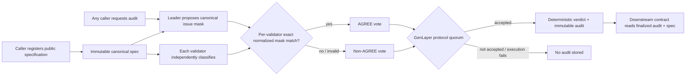

# QuestionZero architecture

QuestionZero separates one non-deterministic classification from every
deterministic state change. It does not fetch or trust URLs, uploaded evidence,
or caller-supplied model results. A URL may appear as inert public rule text.

## Boundaries

### Deterministic registration

`register_spec` normalizes the key, outcome labels, evidence mode, and line
endings before writing a canonical JSON record. The specification ID includes
the registering address, which prevents a second account from taking another
account's normalized key. Repeating byte-for-byte equivalent registration is
idempotent; changing that account's same key is rejected. Each record also
contains a compact SHA-256 fingerprint over the fingerprint schema, creator,
normalized key, policy version, rules, outcomes, evidence mode, and deadline.
That lets another contract bind a finalized `RESOLVABLE` audit to an exact
expected specification without submitting large rule text to a view call.

### Non-deterministic audit

`audit_spec` copies the stored specification into memory and calls
`gl.nondet.exec_prompt` inside `run_nondet_unsafe`. The prompt asks only for a
JSON list of codes from an eleven-code closed set. The leader and each validator
reduce that list to an integer bitmask. Code order therefore does not matter. A
validator agrees only when the leader result is canonical and exactly equals
its independently derived bitmask; GenLayer aggregates those votes and applies
protocol quorum, so one validator disagreement does not necessarily prevent
finality.

### Deterministic persistence

Only an accepted consensus result reaches deterministic persistence. A
malformed or different validator result produces a non-`AGREE` vote. If
protocol quorum accepts the leader result, the contract derives and stores the
verdict; if consensus or execution does not succeed, no audit state is stored.
Audits cannot be overwritten.

## State model

| Storage | Key | Value |
| --- | --- | --- |
| `specs` | `creator-address:SPEC_KEY` | Canonical public specification JSON |
| `spec_exists` | specification ID | Existence marker |
| `spec_ids` | insertion index | Discoverable specification ID |
| `audits` | specification ID | Canonical immutable audit JSON |
| `audit_exists` | specification ID | Existence marker |
| `audit_ids` | insertion index | Discoverable audited specification ID |

There are no privileged mutation methods. `owner` records deployment provenance
only; it has no administrative powers.

## Versioning

The source fixes schema names (`questionzero/spec/v1`,
`questionzero/audit/v1`, and `questionzero/spec-fingerprint/v1`) and the LLM
taxonomy. The constructor fixes a positive `policy_version` for a deployment.
A consumer must require the exact deployment and fingerprint it was designed
against; upgrades or a new taxonomy should use a new deployment rather than
reinterpret existing audits.
